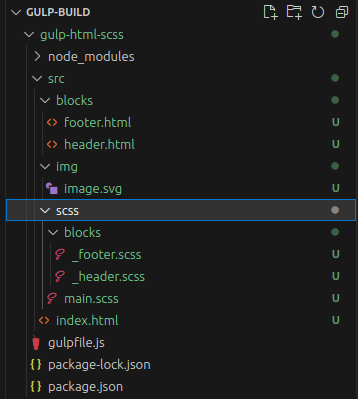

# Сборка GULP #
___
## Установка NODE.JS ##
Для начала устанавливаем NODE.JS если по какой то причине вы им еще не пользовались:

Скачать можно на [официальном сайте.](https://nodejs.org/ru)

Для операционной системы Linux:
Установить NODE.JS:```sudo apt install nodejs```
Установка npm: ```sudo apt install npm```

Проверить установленную версию можно командами:
```node --version``` или ```-v```
```npm --version``` или ```-v```
___
## Подготовка к сборке ##

Создаем папку для сборки например: gulp-html-scss
*Во избежание проблем лучше создавать на системном диске.*

Пакеты которые будут использоваться вложил в отдельный файл:
[Устанавливаемые пакеты для GULP](./Пакеты.md)

___
## Установка NPM пакетов ##

Данный шаг мы делаем в терминале, внутри нашей папки со сборкой:

```npm i gulp --save-dev```

После этого в нашей папке появится каталог node_modules с файлами и папками необходимыми для работы gulp.

Появятся файлы package.json и pakage-lock.json

Так как мы использовали флаг --save-dev в файле package.json сразу появилась зависимость у устанавливаемого пакета.

Файл pakage-lock.json - содержит остальные зависимости пакетов для работы GULP.

Далее установим все остальные пакеты:

```npm i gulp-sass sass gulp-file-include gulp-clean gulp-server-livereload gulp-sourcemaps gulp-plumber gulp-notify gulp-group-css-media-queries --save-dev```

___
## Установка GULP-CLI ##

Для дальнейшей работы нужно глобально установить Command Line Interface для GULP командой:

Для Windows:
```npm install --global gulp-cli```

Для Linux:
```sudo npm install --global gulp-cli```

*Эта утилита позволяет запускать GULP из консоли.*

___
## Создание файла gulpfile.js ##
Внутри этого файла мы напишем команды, которые будем в дальнейшем запускать.

Для этого, в корне папки создаем файл с именем: gulpfile.js
Внутри файла, пишем:

```js
const gulp = require('gulp');
```

После чего, можем создавать "gulp таски, для этого:
```js
gulp.task('название таска', function(){})
```

Для примера можно создать следующий таск:


```js
gulp.task('hello', function(done){
    console.log('Hello from GULP!')
    done()
})
```

****Важно!*** Для корректной работы, таск должен возвращать поток (gulp source) или колл-бек, который будет сигнализировать о завершении задачи.*

Для выполнения действий, которые будут запускаться командой   ```gulp``` в терминале, создаем:  
```js
gulp.task('default', gulp.series('hello'));
```
*Обязательно пердавать строковое значение ```'default'``` и после него указывать необходимые таски через метод ```gulp.series('task1')``` для одиночных задач или ```gulp.parallel('task2','task3','task4',)``` для параллельных.*

___
## Создание структуры проекта ##

Перед сборкой, организуем базовую структуру проекта, для этого создадим папку ```src``` в нашей папке с gulp-ом, где разместим файловую структуру проекта.

Она мало чем отличается от типовой структуры для проектов создаваемых с использованием препроцессора SCSS:



___
## Настройка gulpfile.js ##

Во время настройки, мы должны подключить необходимые плагины и описать задачи которые будут запускаться и выполняться.

Первым мы подключим сам gulp:
```js
const gulp = require('gulp');
```

***Важно!** Имена пакетов которые прописываем в этом файле в качестве 'строки' берем из package.json*

### Подключаем пакет gulp file include: ###
```js
const fileInclude = require('gulp-file-include');
```

Пишем task обрабатывающий html файлы:
```js
gulp.task('html', function(){
    return gulp.src('./src/*.html')
        .pipe(fileInclude({
            prefix: '@@',
            basepath: '@file'
        }))
        .pipe(gulp.dest('./dist/'))
});
```
Функция возвращает поток, поэтому gulp src создает поток.

Далее через "пайпы" мы работаем с файлами и сохраняем их куда нам нужно. 

Мы будем обрабатывать файлы из папки src за исключением папки blocks.

Для лучшего вида, можно разложить все действия в переменные:

```js
const fileIncludeSetting = {
    prefix: '@@',
    basepath: '@file',
}

gulp.task('html', function(){
    return gulp.src('./src/*.html')
        .pipe(fileInclude(fileIncludeSetting))
        .pipe(gulp.dest('./dist/'))
});

```

### Подключаем компиляцию scss (gulp-sass): ###

Для этого внутри gulpfile.js заведём переменную:

```js
const sass = require('gulp-sass')(require('sass'));
```

И напишем "таск" для компиляции scss -> css:

```js
gulp.task('sass', function(){
    //Указваем директорию из которой берем scss файлы:
    return gulp.src('./src/scss/*.scss')
        .pipe(sass())
        //Сохраняем скомпилированные файлы в папку css:
        .pipe(gulp.dest('./dist/css/'))
})

```
После чего, в папке dist будет создана папка css, внутри которой будет создан файл main.css в который будут скомпилированы все стили которые мы пишем в scss файлах.

### Копирование изображений: ###

*Данный "таск" можно будет адаптировать для других задач, когда необходимо копирование любых других файлов из src в папку dist.*

 ```js
 gulp.task('images', function(){
     return gulp.src('./src/img/**/*')
        .pipe(gulp.dest('./dist/img/'))
})
 ```

### Настройка локального сервера (gulp-server-livereload): ###

Создаём переменную для будущего локального сервера:
```js
const server = require('gulp-server-livereload');
```

Далее напишем "таск" для запуска сервера:
```js
gulp.task('server', function() {
    return gulp.src('./dist/').pipe(server({
    livereload: true,
    open: true,
}))
});
```
После чего, можно создать переменную, в которой будем хранить настройки сервера:

```js
const serverOptions = {
    livereload: true,
    open: true,
};
```
И в самом "таске" внутри "пайпа" указать переменную.
```js
gulp.task('server', function() {
    return gulp.src('./dist/').pipe(server(serverOptions))
});
```

**Для пользователей Linux!**
На Ubuntu сервер можно заменить на пакет BrowserSync.
Если оставить ```gulp-server-livereload``` я столкнулся с проблемой, когда использовал настройки сервера описанные выше, терминал выдает ошибку:
```TypeError [ERR_FEATURE_UNAVAILABLE_ON_PLATFORM]: The feature watch recursively is unavailable on the current platform, which is being used to run Node.js```

Для корректной работы пришлось удалить ```livereload: true,``` из переменной serverOptions.

### Удаление папки dist (gulp-clean): ###

В процессе разработки мы будем менять содержимое внутри папки src, а в папку dist эти файлы копируются автоматически.

Чтобы избежать ситуации, когда мы изменили или удалили файл из src, а он остался в папке dist, настроим автоматическое удаление перед каждой сборкой.

Для этого в gulpfile.js создаём новую переменную:

```js
const clean = require('gulp-clean');
```

Также нам понадобится ещё один модуль для работы с файловой системой, его не устанавливали дополнительно, так как он присутствует в node.js

```js
const fs = require('fs');
```

Теперь напишем "таск" удаляющий папку:

```js
gulp.task('clean', function(){
    return gulp.src('./dist/').pipe(clean());
})
```
На этом этапе начнет появляться ошибка, если папка dist отсутствует и запущен таск.

Чтобы её устранить изменим код:
```js
gulp.task('clean', function(done){
    if (fs.existsSync('./dist/')) {
        return gulp.src('./dist/').pipe(clean());
    }
    done();
})
```

Для ускорения работы данного таска, можно отключить чтение файлов перед их удалением, для этого нужно передать объект ```{read:false}``` внутрь gulp.src:

```js
// Таск удаляющий папку dist:
gulp.task('clean', function(done){
    if (fs.existsSync('./dist/')) {
        return gulp.src('./dist/', {read:false}).pipe(clean());
    }
    done();
})
```

Важно! Для удаления файлов для которых требуется разрешение системы, можно добавить объект ```{ force: true }```:

```js
pipe(clean({ force: true }));
```

### Слежение за файлами (watch): ###

Этот "таск" следит за html, css и изображениями и если что то меняется, то происходит пересборка.

```js
gulp.task('watch', function(){
    gulp.watch('./src/scss/**/*.scss', gulp.parallel('sass'));
    gulp.watch('./src/**/*.html', gulp.parallel('html'));
    gulp.watch('./img/**/*', gulp.parallel('images'));

})
```

### Дефолтный таск, запуск сборки: ###

После того, как мы создали необходимые для работы "таски", используем их в дефолтном, который будем запускать командой ```gulp``` в терминале:

 ```js
 gulp.task('default', gulp.series(
    'clean',
     gulp.parallel('html', 'sass', 'images'),
     gulp.parallel('server', 'watch'),
))
 ```

 *При последовательном запуске задач используем: ```gulp.series```, а при параллельном:```gulp.parallel```

### Добавление исходных карт для CSS: ###

Так как через инспектор кода, мы не увидим где именно находятся стили из которых создается объединённый .css файл.
Для добавления карт есть плагин ```gulp-sourcemaps```:

В gulpfile.js создаём переменную:
```js
const sourceMaps = require('gulp-sourcemaps');
```
И далее используем её внутри "таска" sass, первый раз мы их инициализируем ```.pipe(sourceMaps.init())``` а второй - их пишем```.pipe(sourceMaps.write())```. В итоге созданный ранее "таск" sass будет выглядеть следующим образом:

```js
gulp.task('sass', function() {
    return gulp
        .src('./src/scss/*.scss')
        .pipe(sourceMaps.init())
        .pipe(sass())
        //Сохраняем скомпилированные файлы в папку css.
        .pipe(sourceMaps.write())
        .pipe(gulp.dest('./dist/css/'))
});
```
### Группировка медиа запросов: ###

Для группировки медиазапросов мы в начале установили плагин: ```gulp-group-css-media-queries```.
Что бы его подклюить, внутри ```gulpfile.js```:

Создаём переменную для нашего таска:
```js
const groupMedia = require('gulp-group-css-media-queries');
```

Внутри "таска" sass создаем pipe:
```js
.pipe(groupMedia())
```

В итоге "таск" sass должен выглядить таким образом:
```js
gulp.task('sass', function() {
    return gulp
        .src('./src/scss/*.scss')
        .pipe(sourceMaps.init())
        .pipe(sass())
        // Подключение группировки медиа запросов:
        .pipe(groupMedia())
        //Сохраняем скомпилированные файлы в папку css.
        .pipe(sourceMaps.write())
        .pipe(gulp.dest('./dist/css/'))
});
```

***Важно!** При подключении данного таска, нарушается работа плагина ```gulp-sourcemaps``` добавляющего актуальные пути для стилей! Можно закомментировать для отключения.*


### Плагины: plumber и нотификации (gulp-plumber) и (gulp-notify): ###

```gulp-plumber```- позволяет сборке не зависать в случае возникновения ошибок.
```gulp-notify``` -  выводит уведомления об ошибке. (На Ubuntu может работать с ошибками)

Создаём переменные для подключаемых плагинов:
```js
// Переменная для подключения gulp-plumber:
const plumber = require('gulp-plumber');

// Переменная для подключения gulp-notify:
const notify = require('gulp-notify');
```

Далее добавим ```gulp-plumber``` в таски html и scss:
Важно помнить, что```.pipe(plumber())``` подключаем сразу после ```.src('./путь к файлам')```.
Внутри скобок мы пишем настройки для ```plumber``` и опишем их в отдельных переменных:

Переменная с настройками gulp-plumber для "таска" html:
```js
const plumberHtmlConfig = {
    errorHandler: notify.onError({
        title: 'HTML',
        message: 'Error <%= error.message %>',
        sound: false,
    })
};
```

Переменная с настройками gulp-plumber для "таска" sass:
```js
const plumberSassConfig = {
    errorHandler: notify.onError({
        title: 'Styles',
        message: 'Error <%= error.message %>',
        sound: false,
    })
};
```

Подключаем плагин ```gulp-plumber``` в "таск" html:
```js
gulp.task('html', function() {
    return gulp.src('./src/*.html')
        // Подключаем gulp-plumber:
        .pipe(plumber(plumberHtmlConfig))
        .pipe(fileInclude(fileIncludeSetting))
        .pipe(gulp.dest('./dist/'))
});
```

Подключаем плагин ```gulp-plumber``` в "таск" sass:
```js
gulp.task('sass', function() {
    return gulp
        .src('./src/scss/*.scss')
        // Подключаем gulp-plumber:
        .pipe(plumber(plumberSassConfig))
        .pipe(sourceMaps.init())
        .pipe(sass())
        // Подключение группировки медиа запросов:
        //.pipe(groupMedia())
        //Сохраняем скомпилированные файлы в папку css.
        .pipe(sourceMaps.write())
        .pipe(gulp.dest('./dist/css/'))
});
```

### Слежение за шрифтами и файлами: ###

Для слежения за подключаемыми шрифтами и файлами и добавление их в dist:
Создадим "таск" для копирования шрифтов из src в dist:
```js
gulp.task('fonts', function() {
    return gulp.src('./src/fonts/**/*')
        .pipe(gulp.dest('./dist/fonts/'))
});
```

Создадим "таск" для копирования файлов из src в dist:
```js 
gulp.task('files', function() {
    return gulp.src('./src/files/**/*')
        .pipe(gulp.dest('./dist/files/'))
});
```
И добавим созданные "таски" в watch:
```js
gulp.task('watch', function(){
    gulp.watch('./src/scss/**/*.scss', gulp.parallel('sass'));
    gulp.watch('./src/**/*.html', gulp.parallel('html'));
    gulp.watch('./fonts/**/*', gulp.parallel('fonts'));
    gulp.watch('./img/**/*', gulp.parallel('images'));
    gulp.watch('./files/**/*', gulp.parallel('files'));

})
```

### node modules и .gitignore: ###

Так как у нас присутствует папка ```node_modules```, при загрузке проекта на github - мы её не передаём.
Все node модули устанавливаются на основе файла package.json
Человек который получает проект, вводит ```npm i``` и npm на основе пакетов указанных в ```package.json``` устанавливает все необходимые зависимости.

Для того, что бы в git не попадала папка ```node_modules``` создадим новый файл с именем: ```.gitignore```:
Внутри файла пишем: ```node_modules```

После чего папка перестает добавляться в репозиторий. 

### Оптимизация .gulpfile.js: ###

Оптимизируем код который писали ранее что бы избежать лишнего дублирования.
Когда мы настраивали плагин ```gulp-plumber``` для него были созданы переменные с объектами внутри:
```js
// Переменная с настройками gulp-plumber для "таска" html:
const plumberHtmlConfig = {
    errorHandler: notify.onError({
        title: 'HTML',
        message: 'Error <%= error.message %>',
        sound: false,
    })
};

// Переменная с настройками gulp-plumber для "таска" sass:
const plumberSassConfig = {
    errorHandler: notify.onError({
        title: 'Styles',
        message: 'Error <%= error.message %>',
        sound: false,
    })
};
```
Для оптимизации кода, создадим функцию возвращающую аналогичный объект с подставлением значения title:

```js
const plumberNotify = (title) => {
    return {
        errorHandler: notify.onError({
            title: title,
            message: 'Error <%= error.message %>',
            sound: false,
        })
    }
};
```

И перепишем "таск" обрабатывающий html:

Было:
```js
// Пишем task обрабатывающий html файлы:
gulp.task('html', function() {
    // Функция возвращает поток, поэтому gulp src создает поток.
    // Далее через "пайпы" мы работаем с файлами и сохраняем их куда нам нужно. 
    // Мы будем обрабатывать файлы из папки src за исключением папки blocks.
    return gulp.src('./src/*.html')
        // Подключаем gulp-plumber:
        .pipe(plumber(plumberHtmlConfig))
        .pipe(fileInclude(fileIncludeSetting))
        .pipe(gulp.dest('./dist/'))
});
```

Стало:
```js
// Пишем task обрабатывающий html файлы:
gulp.task('html', function() {
    // Функция возвращает поток, поэтому gulp src создает поток.
    // Далее через "пайпы" мы работаем с файлами и сохраняем их куда нам нужно. 
    // Мы будем обрабатывать файлы из папки src за исключением папки blocks.
    return gulp.src('./src/*.html')
        // Подключаем gulp-plumber:
        .pipe(plumber(plumberNotify('HTML')))
        .pipe(fileInclude(fileIncludeSetting))
        .pipe(gulp.dest('./dist/'))
});
```

Аналогичным образом изменяем "таск" для sass:
Было:
```js
// Таск для компиляции scss -> css
gulp.task('sass', function() {
    return gulp
        .src('./src/scss/*.scss')
        .pipe(plumber(plumberSassConfig))
        .pipe(sourceMaps.init())
        .pipe(sass())
        // Подключение группировки медиа запросов:
        //.pipe(groupMedia())
        //Сохраняем скомпилированные файлы в папку css.
        .pipe(sourceMaps.write())
        .pipe(gulp.dest('./dist/css/'))
});
```
Стало:
```js
// Таск для компиляции scss -> css
gulp.task('sass', function() {
    return gulp
        .src('./src/scss/*.scss')
        .pipe(plumber(plumberNotify('Styles')))
        .pipe(sourceMaps.init())
        .pipe(sass())
        // Подключение группировки медиа запросов:
        //.pipe(groupMedia())
        //Сохраняем скомпилированные файлы в папку css.
        .pipe(sourceMaps.write())
        .pipe(gulp.dest('./dist/css/'))
});
```

### Сборка JS модулей: ###
